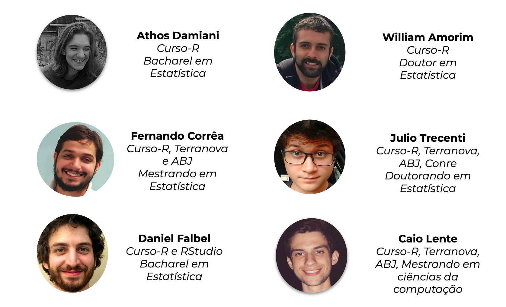
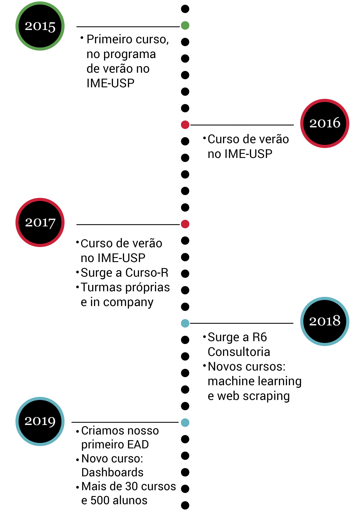
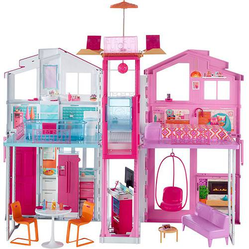

class: middle, center

# bit.ly/amostra-primeiros-passos

---
class: middle, center

# Sobre a Curso-R

---
## curso-r



---

## Linha do tempo

<center>
</img>
</center>

---
class: middle, center

# Sobre o workshop

#### Motivação + Exemplos

---
## Habilidades importantes para um cientista de dados

<br>
<br>

.pull-left[
* Curiosidade

* Análise crítica

* Conhecer o método científico

* Modelar

* Programar
]

--

.pull-right[

]

---
class: middle, center

# Por que programar?

---
## O computador é a ferramenta do cientista de dados

<br>
<center>
 
</center>

---
## Precisamos nos comunicar com o computador

<br>
<center>
 
</center>

---
## Point-click vs linguagens de programação

.pull-left[
<br>

]

.pull-right[
<br> <br> <br> <br>

]


---
class: middle, center

# Linguagens de programação ainda são linguagens

---
class: center, middle

# 1. Código é texto
# 2. Código é legível
# 3. Código é aberto

---
class: middle, center

# Código é texto

---
class: middle, center

### Copiar & Colar 


---
class: middle, center

### Stack Overflow


---
class: middle, center

# Código é legível

---

```{r message=FALSE, warning=FALSE, include=FALSE}
library(magrittr)
library(magick)
library(ggplot2)
library(dplyr)
library(viridis)
```

```{r, eval = FALSE}
image_read("https://jeroen.github.io/images/frink.png") %>%
  image_rotate(270) %>%
  image_background("blue", flatten = TRUE) %>%
  image_border("red", "10x10") %>%
  image_annotate("Liguagens de programação ainda\nsão linguagens!", 
                 color = "white", size = 30)
```


.pull-left[

]


--

.pull-right[
<br>
```{r, eval = TRUE, echo = FALSE}
image_read("https://jeroen.github.io/images/frink.png") %>%
  image_rotate(270) %>%
  image_background("blue", flatten = TRUE) %>%
  image_border("red", "10x10") %>%
  image_annotate("Liguagens de programação ainda\nsão linguagens!", 
                 color = "white", size = 30)
```
]


---

## Código te dá confiança de que está certo!

<center>

</center>

---
class: middle, center

# Código é aberto

---

## Grátis

* Estudantes podem usar as mesmas ferramentas que os profissionais
* Todos podem usar as melhores ferramentas independente do poder financeiro
* Qualquer um pode reproduzir as suas análises


## Aberto

* Você pode corrigir problemas
* Você pode desenvolver suas próprias ferramentas

### Todas as linguagens de programação modernas são open-source.

---
class: middle, center

# Por que usar o R?

---

## Ciclo da ciência de dados


---

## Ciclo da ciência de dados


---

# Exemplos

## Vamos ao R!

<br>
<center>

</center>